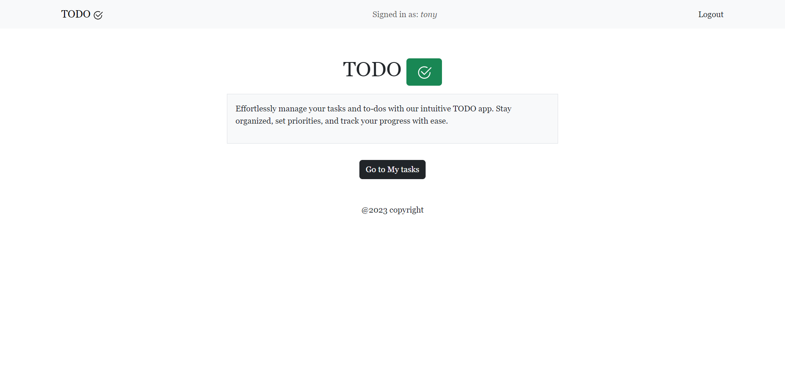
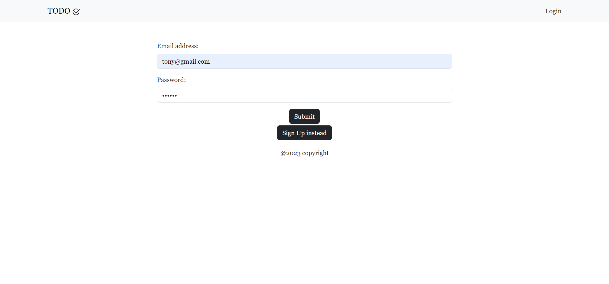
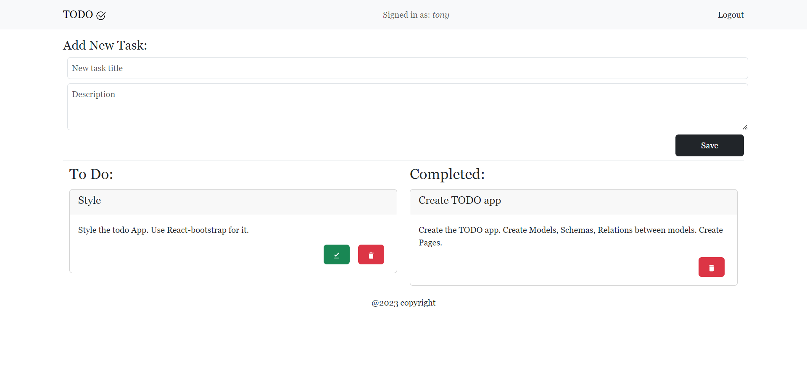

# TO-DO app


## Table of Contents

- [Description](#description)
- [Installation](#installation)
- [Usage](#usage)
- [Questions](#questions)
- [License](#license)

## Description
-  TO-DO is a user-friendly task and to-do list management app that helps you stay organized and boost productivity. Easily create, prioritize, and track your tasks, ensuring you stay on top of your daily responsibilities. Simplify your life and accomplish more with TaskMaster.

 
## Installation

To install necessary dependencies, run the following command:

```npm i```

## Usage

- User has to be logged in to see their tasks.



- User can Add a new task.

- User can check a task to move it into completed, and can also delete a task.




## Questions
 
You can find more about my work at my Github [oliver23n](https://github.com/oliver23n).


## License

 This application was licensed under MIT license.